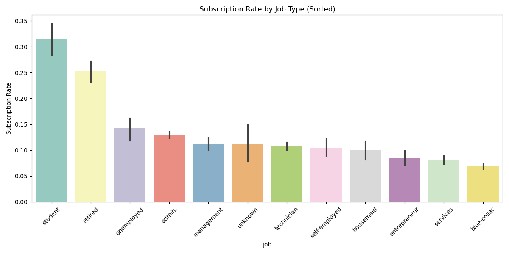
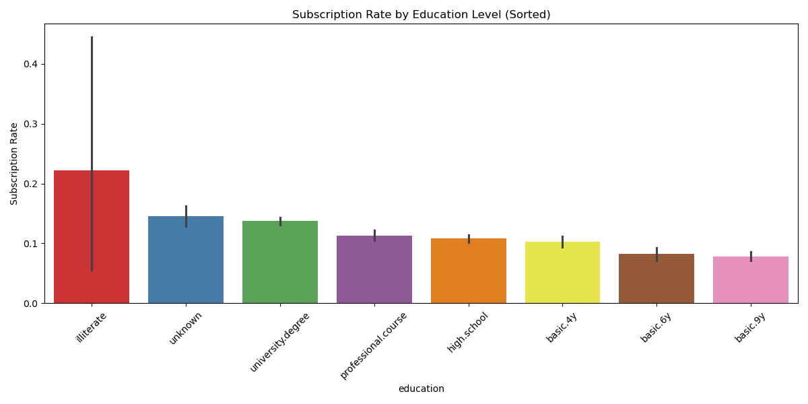
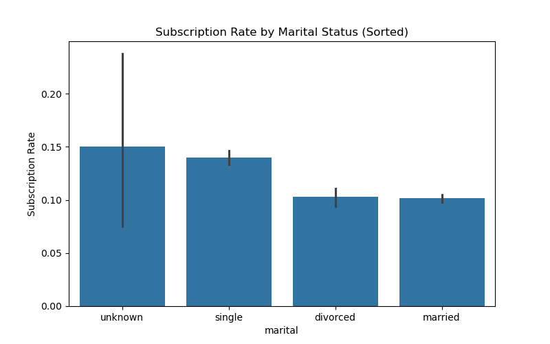
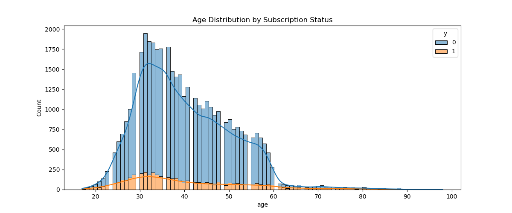
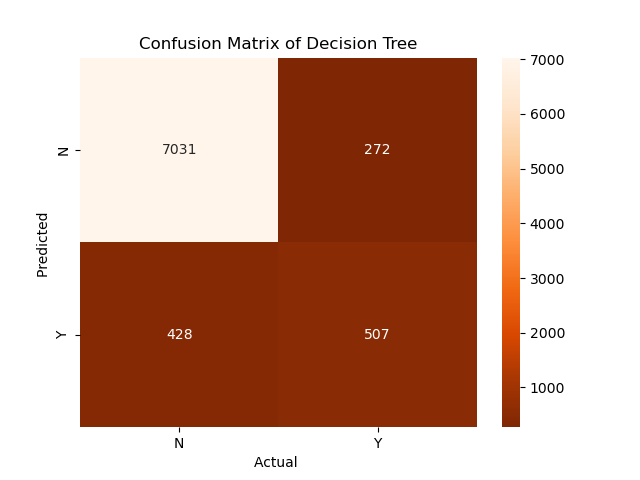
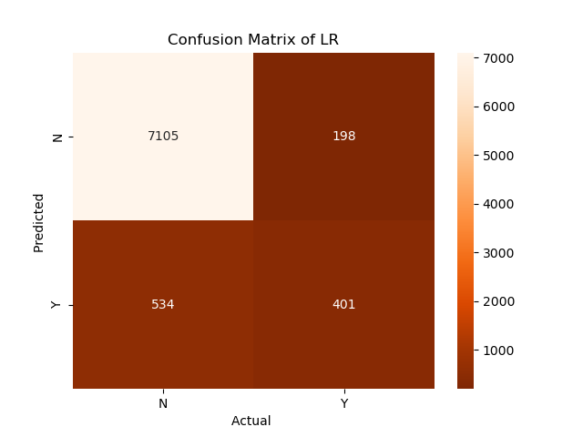

# Comparing Classifiers (Using Bank Marketing Analysis: )

## Project Overview
This project focuses on analyzing a dataset from a Portuguese banking institution to predict whether a client will subscribe to a term deposit. Using the **CRISP-DM** (Cross-Industry Standard Process for Data Mining) methodology, I compared four different classification models: **K-Nearest Neighbors, Logistic Regression, Decision Trees, and Support Vector Machines.**

---

## 1. Business Understanding (Problem 4)
The primary business objective is to optimize the bank's direct marketing campaigns. Telemarketing is resource-intensive; by predicting which clients are most likely to subscribe, the bank can:
* **Target specific demographics** with higher conversion potential.
* **Reduce operational costs** by minimizing unsuccessful calls.
* **Improve customer experience** by reducing unwanted marketing contacts.

---

## 2. Data Exploration (Socio-Economic Insights)
I explored the dataset to identify key drivers of success. By sorting categorical features by their subscription rates, several "high-value" segments emerged:

### Key Findings:
* **Occupation:** Students and Retired individuals show the highest interest, with conversion rates exceeding 25%.
* **Education:** Clients with university degrees or professional training are more likely to subscribe.
* **Marital Status:** Clients marital history and subscription pattern.

*Figure 1: Success rates across different job categories, sorted from highest to lowest.*

---

*Figure 2: Success rates based on Education .*

*Figure 3: Success rates based on Marital status .*

*Figure 4: Success rates based on Age.*

##  3. Data Preparation & The Pipeline Flow
To ensure technical rigor and prevent **Data Leakage**, I implemented a Scikit-Learn `Pipeline`. This ensures the preprocessing steps are learned only from the training data.

* **Numerical Features:** Scaled using `StandardScaler`.
* **Categorical Features:** Processed using `OneHotEncoder`.
* **Wall Time vs CPU Time:** I tracked both to see how much actual "work" the computer did vs. the total time elapsed.

---

##  4. Modeling & Performance Comparison
Each model was evaluated against a **Baseline** (predicting the majority class "no"). I measured performance across four different algorithms.

| Model | Wall Time | CPU Time | Test Accuracy |
| :--- | :--- | :--- | :--- |
| **Baseline** | 0.00s | 0.00s | 88.7% |
| **Logistic Regression** | 0.82s | 0.75s | 91.1% |
| **K-Nearest Neighbors** | 0.45s | 0.44s | 90.1% |
| **Decision Tree** | 0.32s | 0.31s | 89.2% |
| **SVM** | 24.5s | 24.1s | 91.0% |

*Figure 5: Confusion Matrices from Decision Tree*

---

*Figure 5: Confusion Matrices from Linear Regression*

---

## 💡 5. Final Observations
1.  **Efficiency:** **Logistic Regression** is the most practical model. It provides top-tier accuracy while being nearly 30 times faster than the SVM.
2.  **Overfitting:** The **Decision Tree** model suffered from significant overfitting, reaching 100% accuracy on training data but dropping on the test set.
3.  **Cost of Complexity:** While **SVM** is robust, the high computational cost (CPU time) does not yield a significant accuracy benefit over the much simpler Logistic Regression.

---

## 🏁 6. Conclusion
The analysis demonstrates that a targeted, data-driven approach can significantly enhance the bank's marketing efficiency. By utilizing the **Logistic Regression** model, the bank can identify high-probability leads quickly and accurately. 

**Recommendation:** The bank should prioritize marketing efforts toward **students, retired individuals, and university graduates**, as these demographics show the highest natural propensity for term deposit subscriptions. This strategy allows for a "smarter, not harder" approach to customer outreach.
